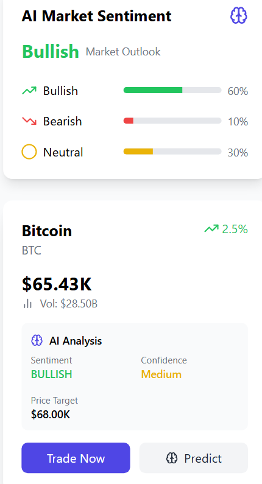

# CryptoAI - Cryptocurrency Trading Platform

CryptoAI is a modern cryptocurrency trading platform that combines real-time market data with AI-powered predictions and sentiment analysis. Built with React, TypeScript, and Tailwind CSS, it offers an intuitive interface for tracking, analyzing, and trading cryptocurrencies.

## Features

- 📊 Real-time cryptocurrency market data
- 🤖 AI-powered price predictions and sentiment analysis
- 📈 Interactive portfolio management
- 🌓 Dark/Light mode support
- 📱 Responsive design for all devices
- 💰 Virtual trading simulation
- 📊 Portfolio performance tracking
- 📈 Market sentiment analysis

## Tech Stack

- **Frontend Framework:** React
- **Language:** TypeScript
- **Styling:** Tailwind CSS
- **Routing:** React Router
- **Charts:** Recharts
- **Icons:** Lucide React
- **State Management:** React Context

## Getting Started

### Prerequisites

- Node.js (v14 or higher)
- npm or yarn

### Installation

1. Clone the repository:

2. Install dependencies:

3. Start the development server:

4. Open [http://localhost:5173](http://localhost:5173) in your browser

## Project Structure
src/
├── components/ # Reusable UI components
├── context/ # React Context providers
├── data/ # Mock data and constants
├── pages/ # Page components
├── services/ # API and utility services
├── types/ # TypeScript type definitions
└── App.tsx # Root component

## Key Components

- **Market Page:** View real-time cryptocurrency prices and AI predictions
- **Dashboard:** Track your portfolio performance and manage positions
- **CryptoCard:** Display individual cryptocurrency information
- **PortfolioChart:** Visualize portfolio performance
- **MarketSentiment:** Analysis of market trends and sentiment

## Features in Detail

### AI Predictions
- Price target predictions based on historical data
- Market sentiment analysis
- Confidence scoring system
- Contributing factors explanation

### Portfolio Management
- Track multiple cryptocurrency positions
- Real-time profit/loss calculations
- Position management (buy/sell)
- Portfolio performance visualization

### Market Analysis
- Real-time price updates
- 24-hour price changes
- Market capitalization
- Trading volume
- AI-powered market sentiment

## Contributing

1. Fork the repository
2. Create your feature branch (`git checkout -b feature/AmazingFeature`)
3. Commit your changes (`git commit -m 'Add some AmazingFeature'`)
4. Push to the branch (`git push origin feature/AmazingFeature`)
5. Open a Pull Request

## License

This project is licensed under the MIT License - see the [LICENSE](LICENSE) file for details

## Acknowledgments

- [CoinGecko API](https://www.coingecko.com/en/api) for cryptocurrency market data
- [Tailwind CSS](https://tailwindcss.com/) for styling
- [Lucide React](https://lucide.dev/) for icons
- [Recharts](https://recharts.org/) for charts
